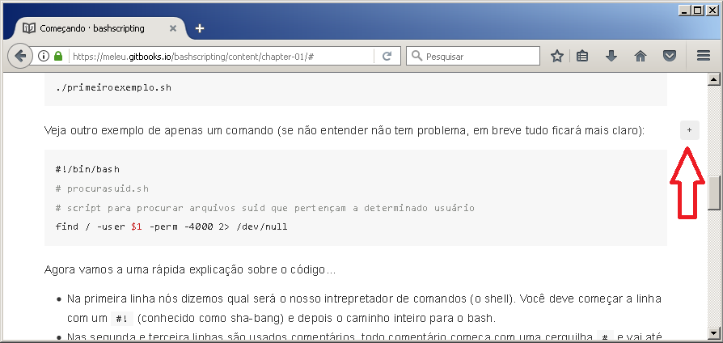
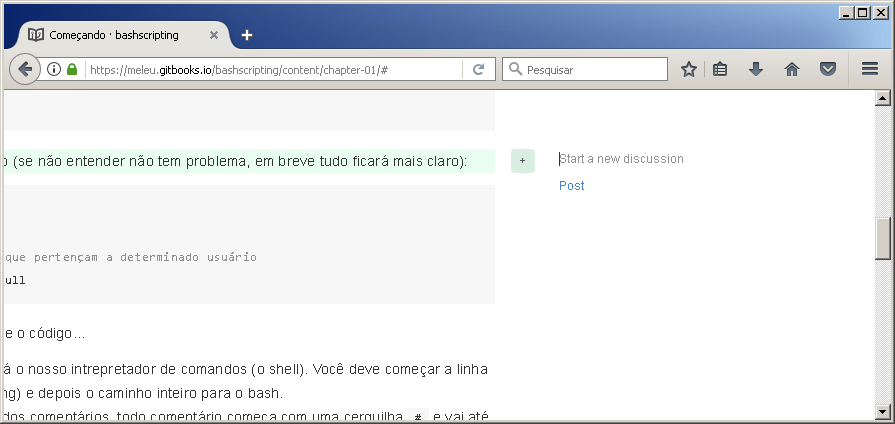

# Como Contribuir

Este livro foi escrito utilizando as facilidades do [gitbook.com](https://www.gitbook.com/), uma destas facilidades é o recurso de permitir que os leitores façam comentários sobre trechos do texto.

Se você estiver lendo este livro pela versão web, é possível contribuir de
maneira muito fácil e direta.

Por exemplo, caso queira comentar sobre algo no texto (dúvida, informação errada, texto mal escrito, etc.) posicione o cursor do mouse no parágrafo em questão e então aparecerá um ícone com um símbolo de mais `+` a direita. Conforme a imagem a seguir:

Clique neste ícone e abrirá um campo para você inserir seu comentário, conforme pode ser visto aqui:

**Obs.:** para utilizar este recurso você precisa estar logado no gitbook.com.
Caso não tenha uma conta, não tem problema, você pode se logar usando sua conta do facebook, twitter, google (gmail), ou github.

Caso você queira contribuir com código, basta ir direto no [repositório do livro](https://github.com/meleu/bashscripting) e mandar um Pull Request. Os códigos ficam no [diretório src](https://github.com/meleu/bashscripting/tree/master/src).

A única regrinha a ser seguida é que a segunda linha do script tenha um comentário contendo somente o nome do arquivo. Como opcional você pode inserir um crédito com seu nome e colocar algum link seu. Exemplo:



Também é possível contribuir editando o próprio texto diretamente no repositório do github e mandando um Pull Request.

Todas as contribuições recebem o merecido crédito na seção de {{ book.agradecimentos }}.
